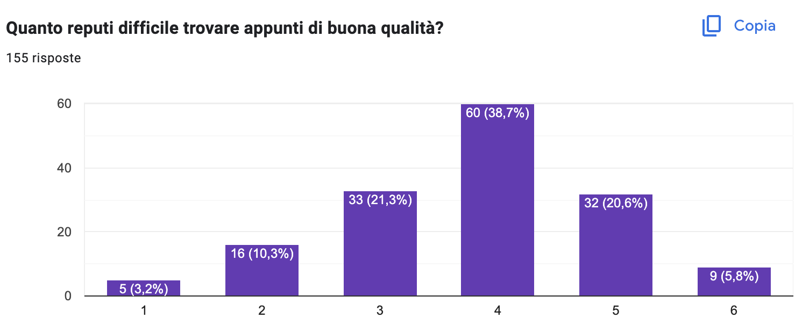
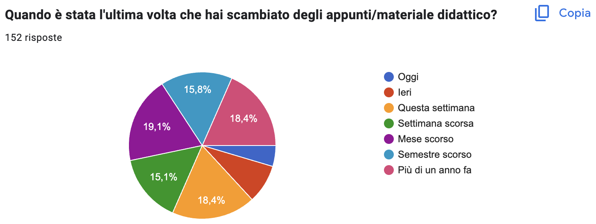
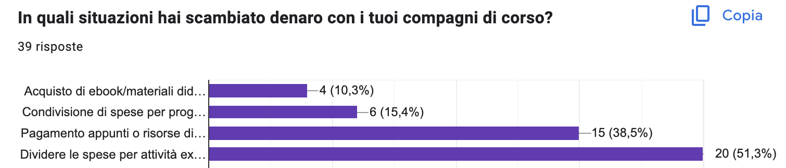
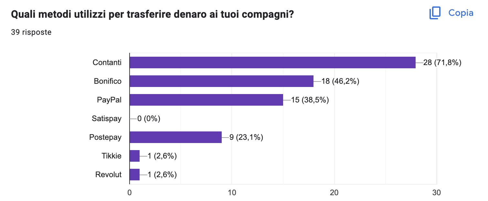
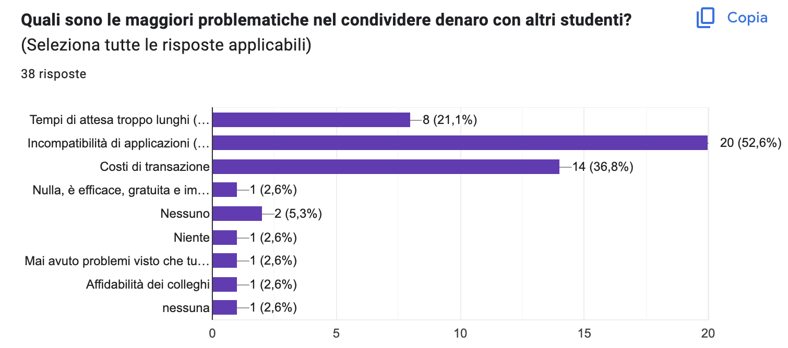

# Needs

Below will be discussed what are the users' needs based on the responses received from the questionnaire. 

## Notes/Teaching Material

From the questionnaires, clearly results the difficulty of students in finding good notes

The notes, or the teaching material, are ***exchanged very often*** (as shown in the image below) and  are searched principally on:

- *Web sites of the professor* (Classroom, Moodle, Drive, ...)
- *Groups on social media* 
- *Web*
- *Ask friends*

## Money

As regards for the money, the students exhange them **often** and **easily**.

In particular, money is traded in these situations

1. ***Split charges for extracurricular activities*** - *51,3%*
2. ***Payments for notes or study resources*** - *38,5%*
3. ***Sharing of project expenses*** - *15,4%*

Regarding the means, these are the most used

And, the main problems around the exchange of money are the following:

